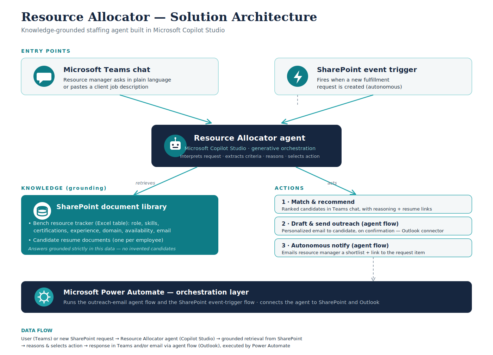

# Resource Allocator — AI-Powered Resource Allocation & Staffing Assistant

An autonomous, knowledge-grounded AI agent built in **Microsoft Copilot Studio** that helps
resource managers match available bench employees to incoming project requirements — in
seconds, through natural language — and act on the results.

Built for the **Microsoft Agent Academy Hackathon (Recruit track)**.

---

## The Problem

In IT services organizations, staffing projects from the bench is still a manual process.
When a new client requirement or job description arrives, resource managers manually search
spreadsheets and resumes to find a match. It's slow, error-prone, and leaves available
talent underutilized.

**Target users:** resource managers and project/staffing managers who need to match
available employees to incoming project requirements quickly.

---

## What It Does — Three Capabilities

### 1. Natural-language / job-description search
Ask in plain language or paste a client job description. The agent extracts the criteria
(role, skills, experience, certifications, domain, availability) and returns the best-fit
available candidates — ranked, with the reasoning behind each match, and links to their
resumes.

### 2. Draft & send outreach
For a selected candidate, the agent drafts a personalized outreach email referencing their
fit, shows it for review, and sends it on confirmation via the Office 365 Outlook connector
(human-in-the-loop).

### 3. Autonomous matching
When a new fulfillment request is logged in SharePoint, an event trigger fires: the agent
automatically matches candidates and emails the resource manager a shortlist with the
request details, each candidate's fit, and a link back to the request item — no prompting
needed.

---

## Architecture

**Entry points (two):**
- Conversational — a resource manager chats with the agent in Microsoft Teams.
- Autonomous — a SharePoint "when an item is created" event trigger fires on a new
  fulfillment request.

**Agent:** Microsoft Copilot Studio with generative orchestration. Interprets the request,
reasons over its knowledge, and selects the appropriate action.

**Knowledge source:** a SharePoint document library containing the bench resource tracker
(an Excel table of employees with role, skills, certifications, experience, domain,
availability, and email) and individual candidate resume documents. Answers are grounded
strictly in this data.

**Actions:**
1. Match & recommend — ranked candidates in the Teams chat with reasoning + resume links.
2. Draft & send outreach — email a selected candidate via an agent flow (Outlook connector).
3. Autonomous notify — email the resource manager a shortlist via an agent flow.

**Orchestration:** Microsoft Power Automate runs the outreach-email agent flow and the
SharePoint event-trigger flow, connecting the agent to SharePoint and Outlook.

**Data flow:**
`User (Teams) or new SharePoint request → Resource Allocator agent (Copilot Studio) →
grounded retrieval from SharePoint → reasons & selects action → response in Teams and/or
email via agent flow (Outlook), executed by Power Automate.`

---

## Tech Stack

- **Microsoft Copilot Studio** — agent with generative orchestration
- **SharePoint** — knowledge source (document library) and event-trigger source list
- **Power Automate** — agent flow + event-trigger flow
- **Office 365 Outlook connector** — outreach and notification emails
- **Microsoft Teams** — deployment channel
- **Microsoft Excel** — bench resource tracker (formatted as a table for indexing)

---

## Agent Academy Modules Applied

- **Copilot Studio Fundamentals (Lesson 02)** — knowledge, skills, and autonomy building blocks
- **Creating a Solution (Lesson 04)** — packaged the agent into a reusable solution
- **Build a Custom Agent grounded in knowledge sources (Lesson 06)** — grounded in SharePoint
- **Automate with Agent Flows (Lesson 09)** — outreach email via the Outlook connector
- **Add Event Triggers (Lesson 10)** — autonomous match-and-notify on new requests
- **Publish Your Agent (Lesson 11)** — deployed to Microsoft Teams

---

## Repository Contents

| File / Folder | Description |
|---|---|
| `solution/` | Exported Copilot Studio solution (.zip) — the agent, agent flows, and event-trigger flow |
| `data/Bench_Resources.xlsx` | The bench resource tracker (Excel table) used as the knowledge source |
| `data/resumes/` | Candidate resume documents (knowledge source) |
| `Resource_Allocator_Architecture.png` | Solution architecture diagram |

---

## Setup / Import Notes

1. **Import the solution:** in the Power Platform maker portal (make.powerapps.com) →
   Solutions → Import solution → select the .zip in `solution/`.
2. **Set environment variables:** during or after import, provide values for the
   solution's environment variables:
   - `ResourceAllocatorSharepoint` — the SharePoint site/library URL used as the knowledge
     source and the event-trigger location
   - `ResourceManagerEmail` — the email address that receives autonomous match notifications
3. **Recreate the knowledge source:** create a SharePoint document library, upload
   `Bench_Resources.xlsx` and the resume files, and add the library as a knowledge source
   to the agent.
4. **Create the trigger list:** create a "Fulfillment Requests" SharePoint list (columns:
   RequiredRole, RequiredSkills, MinExperience, DomainPreference, Priority, RequestedBy,
   Status) for the event trigger.
5. **Reconnect connectors:** re-establish the Office 365 Outlook and SharePoint
   connections after import.
6. **Publish** the agent to Microsoft Teams.

> Note: the exported solution contains the agent and flows. The SharePoint data
> (tracker + resumes) lives in SharePoint and is provided here under `data/` to recreate
> the knowledge source.

---

## Demo

A walkthrough video (≤ 5 minutes) demonstrates all three capabilities: natural-language /
JD search, draft-and-send outreach, and autonomous matching on a new request.

*Demo video: https://youtu.be/acGNcNscQ4I *
